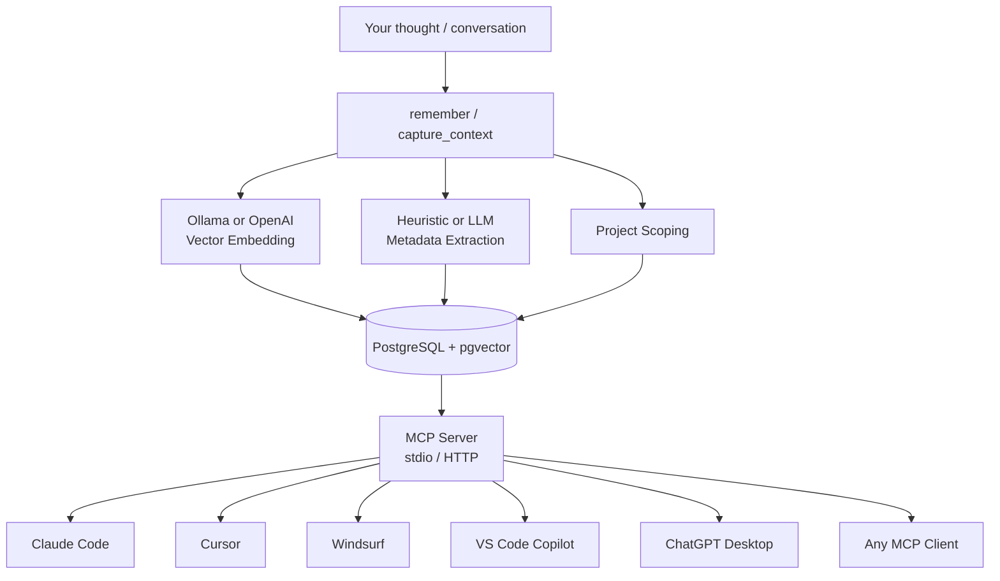

# Architecture Overview

Open Brain is a single Python MCP server (`server.py`) backed by PostgreSQL + pgvector. It exposes 19 tools over stdio or HTTP that any MCP-compatible AI client can call.

---

## System Diagram



---

## Data Flow

### Writing (Capture)

1. An agent calls `remember` (single fact) or `capture_context` (session text)
2. `capture_context` optionally decomposes the text into atomic memories via a local LLM
3. Each memory is embedded via Ollama or OpenAI
4. Metadata is extracted (type, people, topics, action items) via heuristic or LLM
5. Deduplication check: if a near-identical memory exists (cosine similarity >= 0.92), skip or update
6. Stored in PostgreSQL with the embedding vector, metadata JSONB, and project tag

### Reading (Recall)

1. An agent calls `search` with a natural language query
2. The query is embedded using the same model
3. pgvector finds the nearest neighbors via HNSW index
4. Results are filtered by type, people, or project if specified
5. Previews (200 chars) are returned to save tokens
6. The agent calls `recall` with specific IDs to get full content

---

## Components

| Component | Technology | Purpose |
|-----------|-----------|---------|
| MCP Server | Python + FastMCP | Exposes 19 tools over stdio/HTTP |
| Database | PostgreSQL 16 + pgvector | Vector storage, JSONB metadata, full SQL |
| Test Database | PostgreSQL 16 + pgvector (separate container) | Isolated test environment on port 5434 |
| Vector Index | HNSW (m=16, ef=64) | Fast approximate nearest-neighbor search |
| Embeddings | Ollama (`nomic-embed-text`) | 768-dim dense vectors, runs locally |
| Metadata LLM | Ollama (`qwen2.5:32b`) | Rich extraction of people, topics, types |
| Wire CLI | Python (`wire.py`) | Auto-discovers and configures MCP clients |

---

## File Structure

```
open-brain/
├── server.py               # MCP server, 19 tools
├── wire.py                 # Agent auto-discovery + wiring CLI
├── requirements.txt        # Python dependencies
├── test_server.py          # End-to-end test suite
├── docker-compose.yml      # PostgreSQL + pgvector (production)
├── docker-compose.test.yml # Isolated test database (port 5434)
├── conftest.py             # pytest safety: forces test DB, fake embeddings
├── pyproject.toml          # pytest configuration
├── .env.example            # Config template
├── prompts/
│   ├── windsurf-rules.md   # Auto-capture rules for Windsurf
│   ├── cursor-rules.md     # Auto-capture rules for Cursor
│   ├── claude-desktop.md   # System prompt for Claude Desktop
│   └── generic-system-prompt.md
└── scripts/
    ├── setup_db.py         # One-time DB initialization
    ├── migrate_v2.py       # v1 -> v2 schema migration
    └── ensure-stack.sh     # Verify/start Ollama + DB (WSL)
```

---

## Cost

| Component | Monthly Cost |
|-----------|-------------|
| PostgreSQL + pgvector (Docker) | $0 |
| Ollama embeddings (local) | $0 |
| Ollama metadata LLM (local) | $0 |
| OpenAI embeddings (if used) | ~$0.10-$0.30 |
| **Total (local stack)** | **~$0/month** |
