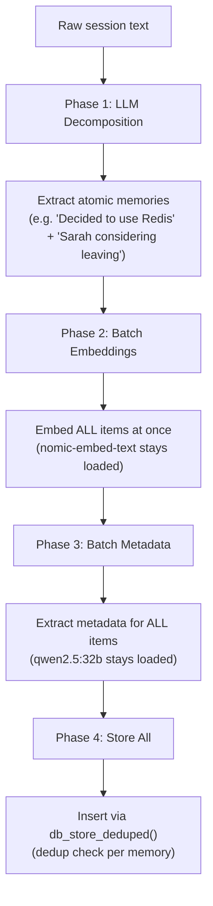

# Smart Batching

The `capture_context` tool uses a multi-phase batching algorithm to efficiently process session text on local hardware.

---

## The Problem

On systems with limited VRAM, Ollama can only load 1-2 models at a time. A naive approach — embed one memory, extract metadata for it, embed the next, extract metadata — causes constant model swapping. Each swap takes 10-40 seconds as models are loaded/unloaded from GPU memory.

---

## The Solution

`capture_context` batches all work by phase, keeping each model loaded for as long as possible:



### Phase 1 — LLM Decomposition

If `METADATA_LLM_MODEL` is set, the raw session text is sent to the LLM with instructions to extract atomic, self-contained memories. A paragraph about three topics becomes three separate memories.

**Fallback:** If the LLM is unavailable, the entire text is stored as a single memory.

### Phase 2 — Batch Embeddings

All extracted items are embedded in sequence while `nomic-embed-text` is loaded. No model swaps happen during this phase.

### Phase 3 — Batch Metadata

Once all embeddings are done, the metadata LLM is loaded and extracts type/people/topics/action_items for all items in sequence.

### Phase 4 — Store

All memories are inserted into PostgreSQL with deduplication checks.

---

## Performance Impact

| Scenario | Without Batching | With Batching |
|----------|-----------------|---------------|
| 5 memories, dual model | ~200s (constant swaps) | ~15s |
| 5 memories, single model | ~10s | ~8s |
| Model loads per capture | 2 × N memories | 2 total |

---

## Configuration

Batching is automatic when `METADATA_LLM_MODEL` is set. For best results:

```env
OLLAMA_MAX_LOADED_MODELS=2
```

This tells Ollama to keep both models in VRAM simultaneously, eliminating even the initial swap penalty.
