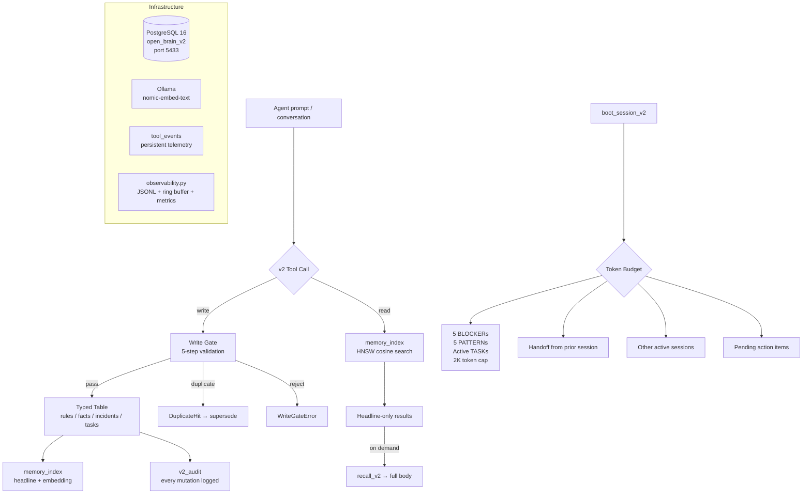

# brain_v2 Architecture

brain_v2 is a ground-up redesign of Open Brain's memory storage, retrieval, and observability.
It runs alongside v1 as a separate MCP server on its own database. v1 remains untouched.

---

## Why v2?

v1 stores every memory in a single `memories` table with a JSONB `metadata` column.
This worked until:

- **Boot payloads bloated to 15K+ tokens** — every pinned guardrail loaded in full at every session start.
- **Merge pathology** — the smart-merge LLM concatenated related guardrails into walls of text. One memory reached 2,000 words across 6 date-stamped updates.
- **Type confusion** — a behavioral rule and a project fact are fundamentally different objects with different lifecycles, but v1 treats them as the same row with a different `metadata.type` tag.
- **No write gate** — any agent could store anything with no structural validation.

v2 fixes these by separating types at the schema level, enforcing structure at write time,
and delivering headline-only boot payloads with bodies fetched on demand.

---

## System Diagram



---

## Four Atomic Memory Types

v2 enforces memory type at the schema level. Each type has its own table,
its own retrieval policy, and its own lifecycle.

| Type | Table | Lifecycle | Retrieval at Boot |
|------|-------|-----------|-------------------|
| **RULE** | `rules` | Immutable body. Modify via `supersede_rule_v2` only. Never decays. Never deleted. | BLOCKERs: protected (pinned / `always_on`) rules always shown, then unprotected fill up to the cap — a critical safety rule is never evicted by the cap. PATTERNs: top 5 by task-relevance cosine. |
| **FACT** | `facts` | Access-based Ebbinghaus decay (halflife 7 days default). Hard TTL optional. Reactivates on recall. | Not loaded at boot. Available via `search_v2` + `recall_v2`. |
| **INCIDENT** | `incidents` | Soft archive after 90 days no access. Searchable but not in boot. | Not loaded at boot. |
| **TASK** | `tasks` | Lifecycle states: `open` / `blocked` / `done` / `stale`. Cross-session obligations. | Active tasks loaded (up to 20, priority-ordered). |

A shared `memory_index` table holds the headline + embedding projection for cross-type
search without materializing bodies from four tables.

---

## Write Gate (5 steps)

Every write passes through `write_gate.run_gate()` before landing in a typed table:

1. **Type declared and valid** — kind must be `rule`, `fact`, `incident`, or `task`.
2. **Severity valid** (rules only) — must be `BLOCKER` or `PATTERN`. `DEPRECATED` is set only by supersede.
3. **Headline present, <=15 words** — forces atomic, scannable summaries.
4. **Atomicity check** — body must be <=400 words. Bodies with multiple date-stamped GUARDRAIL markers are rejected (the v1 merge pathology).
5. **Duplicate detection** — cosine similarity >0.75 against same-kind active entries returns a `DuplicateHit`. Caller must route to `supersede_rule_v2` instead of creating a parallel rule.

**Merge is an invalid operation for RULE type.** Rules are immutable. The only legal
modification path is supersede — old rule goes DEPRECATED, new rule links to it,
audit trail preserved.

---

## Boot Payload

`boot_session_v2` returns a **headline-only** payload with hard caps:

| Section | Cap | Source |
|---------|-----|--------|
| BLOCKER rules | 5 headlines | Pinned + severity=BLOCKER, project-scoped |
| PATTERN rules | 5 headlines | Task-relevance ranked by cosine similarity |
| Active tasks | 20 (configurable) | Priority-ordered, `open` or `blocked` status |
| Working context | Regenerated | Ephemeral — built from `task` arg, never stored |
| Handoff | 2000 chars | Auto-populated from prior session's handoff note |
| Other sessions | All active | Sibling sessions in the same project |
| Action items | All pending | Block writes until acknowledged |
| **Total token cap** | **2000** | Truncation order: tasks, then patterns, then blockers |

Bodies are fetched on demand via `recall_v2(kind, memory_id)`.

Skills with `always_on: false` are excluded from boot — they surface only on keyword
match via `search_v2` or explicit `load_skill_v2`.

---

## Observability

v2 ships a full observability stack:

| Component | Purpose |
|-----------|---------|
| `observability.py` | JSONL rotating log (5MB x 5 files), in-memory ring buffer (500 entries), per-tool call counts / error counts / avg+p99 latency, Windows desktop toast alerts on errors |
| `tool_events` table | Persistent telemetry for every MCP tool call (reads AND writes). `session_id` is NOT NULL — pre-boot events buffered to JSONL on disk, flushed on `boot_session_v2` |
| `metrics_v2` tool | Per-tool call counts, error rates, avg/p99 ms — queryable from any MCP client |
| `recent_errors_v2` tool | Last N errors from ring buffer |
| `health_v2` tool | DB connectivity, Ollama reachability (socket-level, respects 5s timeout), table row counts, server uptime, tool list |
| `v2_audit` table | Every write mutation (INSERT, SUPERSEDE, UPDATE, FORGET, PRUNE) with snapshot |

---

## Session Registry

Same liveness model as v1 v0.14.0 — process lifecycle is authoritative, no TTL.

- `boot_session_v2` registers a row, returns sibling sessions + auto-loaded handoff
- `update_active_task_v2` bumps heartbeat + updates task description
- `end_session_v2` marks session ended, optionally writes a handoff note
- Supersede-on-reboot: same (source, cwd, pid) tuple ends the prior row

---

## Skills Layer

Ported from v1 v0.12.0. Skills are rules with a `skill_trigger` JSONB column:

```json
{
  "name": "ollama-shutdown-graceful",
  "keywords": ["ollama", "shutdown", "graceful"],
  "projects": [],
  "always_on": false
}
```

- `always_on: false` — excluded from boot, surfaces on keyword match in `search_v2` or via `load_skill_v2`
- `always_on: true` — loaded at boot like a legacy pinned guardrail
- `skill_trigger: null` — backwards compatible, loads at boot if pinned

---

## Database

| Container | Port | Database | Purpose |
|-----------|------|----------|---------|
| `open-brain-db` | 5432 | `openbrain` | v1 production |
| `open-brain-v2-db` | 5433 | `open_brain_v2` | v2 production |
| `open-brain-test-db` | 5434 | `openbrain_test` | Test isolation |

v2 uses a separate Postgres container. v1's data is never touched.

---

## v1 vs v2 at a Glance

| Aspect | v1 | v2 |
|--------|----|----|
| Storage | Single `memories` table | 4 typed tables + shared `memory_index` |
| Write path | Auto-detect type via LLM, merge on overlap | 5-step write gate, no LLM in write path |
| Rule modification | Direct update (history lost) | Immutable bodies, supersede-only |
| Boot payload | Full content of pinned memories (15K+ tokens) | Headline-only, 2K token cap |
| Decay | None | Ebbinghaus access-based for facts, 90-day archive for incidents |
| Observability | `observability.py` + `telemetry.py` | Full stack + persistent `tool_events` table |
| MCP namespace | `mcp__open-brain__*` | `mcp__open-brain-v2__*` |
| Tool count | 26 | 39 |
| Tests | ~90 | 203 (all real Postgres + real Ollama) |
| Version | 0.14.0 | 2.0.0 |
